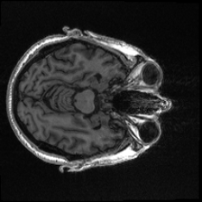
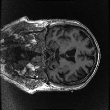
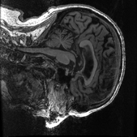

# AD Detection

follow the setup below to initial env

```
1. >> create a env based on Python version = 3.12

2. >> pip install -r requirements.txt

-- if it dont work, try step4

3. >> bash utils/download_kaggle_dataset.sh

4. >> pip install torch==2.5.0 torchvision==0.20.0 torchaudio==2.5.0 --index-url https://download.pytorch.org/whl/cu121
```


| Method | Params | Accuracy | Macro-F1 | Macro-AUC | Balanced Acc. | Cohen's $\kappa$ | MCC (Multi-class) |
| :--- | :--- | :--- | :--- | :--- | :--- | :--- | :--- |
| **VGG16 (2D-TL)** | 134.3 M | 0.4146 | 0.4245 | 0.8082 | 0.4467 | 0.2483 | 0.2918 |
| **3D-ResNet** | 33.4M | 0.6097 | 0.6620 | 0.8351 | 0.6666 | 0.5034 | 0.5064 |
| **3D-ViT (SOTA)** | | | | | | | |
| **P3D-AttnNet (Ours)** | | | | | | | |


The VGG16 2D IMAGE Come from the combination of 3 slice like the image below.

<p align="center">
  
</p>

<p align="center">
  
</p>

<p align="center">
  
  
  
</p>
